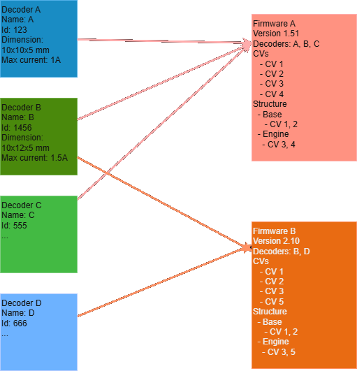
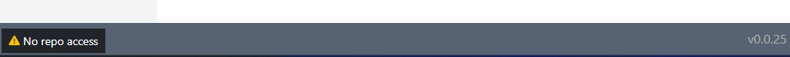

# BiDiB-DecoderDB

DecoderDB is an open repository for decoder and firmware definitions

Definitions are currently used by BiDiB-Monitor to provide comfortable support with managing configuration variables (CVs) of the local decoder stack.

## Decoders & Firmware

The repository contains 2 kinds of data. Decoder definitions and firmware definitions.
The decoder definition describes the base specifications a decoder like product identifieres, dimensions, electrical limits but also references to products images and manuals.

The firmware definition contains the descriptions of all configuration variables available for the corresponding firmware version. It also contains a struture definition to navigate through the huge amout of variables in an easy way.

The reference between decoder definition and firmware definition is done via a list of decoder names inside the firmware definition.



## Contribution

To contribute any changes to the decoder or firmware definitions just clone this repository and modify the json files within the `repo/[decoder/firmware]` folder and push the changes afterwards.
As this repository is meant to be a community project, quality contributions are highly appreciated!

To overcome the cumbersome manual editing of the json files there is an editor available.
The editor can be accessed either via the [published online version](https://www.fichtelbahn.de/files/decoderDB) or started from within the repository.

With the editor the local repo files can be edited in a comfortable way.
Once work is done and changes are saved they have to be committed and pushed manually.

In any case the editor application needs read and write access to the local repository `/repo` folder.
It will ask for it once you try to enable the edit mode for a decoder or firmware definition.


The permission is also checked on start and indicated in the status bar.
If access is not granted it can be set via the button there.


:warning: _Currently only Chromium based browsers are supporting the file access api which is used the modify the local files!_

## Deployment

Changes can be done manually direcly in this repository at any time.

Every commit / push within the `repo/` folder on main branch triggers the workflow to updates the repository[2].json reference and publish the changes.
The update source is currently available via [repository.json](https://www.fichtelbahn.de/files/decoderDB/repository.json) / [repository2.json](https://www.fichtelbahn.de/files/decoderDB/repository2.json)

The `repository.json` contains the reference links to the orginal _.decdb_ files, while `repository2.json` references the new _.json_ files.

Changes to the editor sources within `src/Editor` will trigger the editor workflow accordingly, which is currently published to https://www.fichtelbahn.de/files/decoderDB .

Changes to the generator code does not trigger any workflow at the moment.

## Generate single json firmware file from decdb file

To generate a single json firmware file from en existing decdb file, run the following command in the project root:

```
dotnet run --configuration Release --project .\src\RepoGenerator\ --repoPath .\repo\ --saveJson true --file Firmware_145_5.5
```

:grey_exclamation: This step is not required for the general use of editor!
