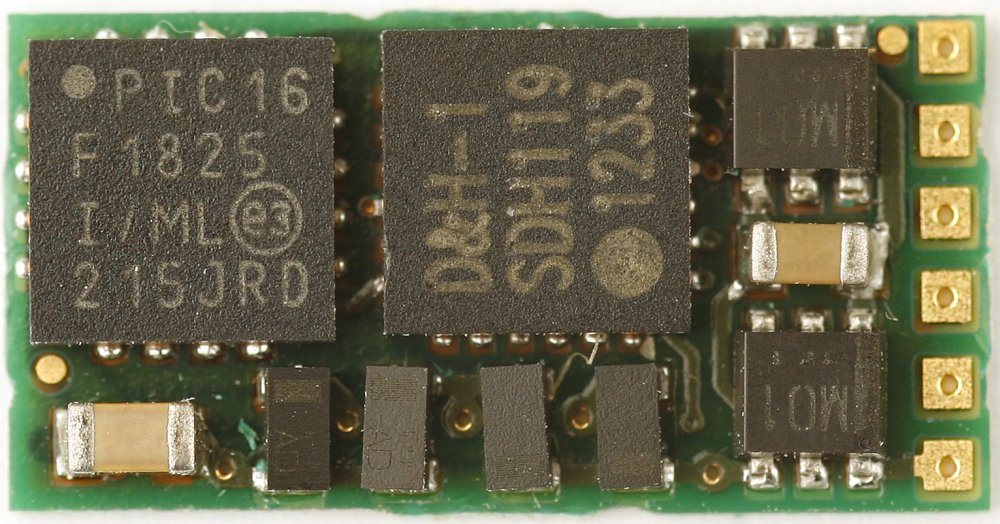
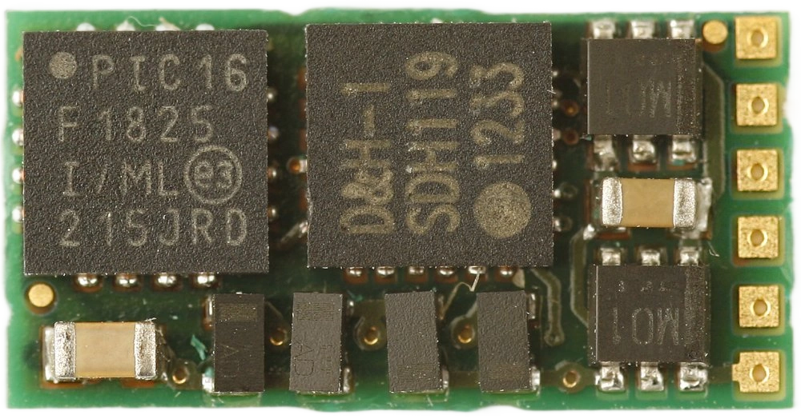

# Webp

Decoder images often contain an ugly white frame which makes their use in applications with dark mode impossible. This folder contains two scripts which deal with this issue. `image2webp` automatically removes the background and stores the resulting image as `.webp`. `webp2json` adds the new image to a Decoder JSON file.

| Before                                                   | After                                                      |
| -------------------------------------------------------- | ---------------------------------------------------------- |
|  |  |

<details>
  <summary>Table of Contents</summary>
  <ol>
    <li><a href="#getting-started">Getting Started</a></li>
      <ul>
        <li><a href="#prerequisites">Prerequisites</a></li>
        <li><a href="#installation">Installation</a></li>
      </ul>
    <li><a href="#usage">Usage</a></li>
      <ul>
        <li><a href="#image2webp">image2webp</a></li>
        <li><a href="#webp2json">webp2json</a></li>
        <li><a href="#useful-snippets">Useful Snippets</a></li>
      </ul>
  </ol>
</details>

## Getting Started
Install prerequisites -> run scripts -> :moneybag:

Please check the results before committing them though.

### Prerequisites
- [Pillow](https://pypi.org/project/pillow)
- [transparent-background](https://github.com/plemeri/transparent-background)

### Installation
```sh
python -m venv .venv
source .venv/bin/activate
python -m pip install -r requirements.txt
```

## Usage
### image2webp
```sh
usage: image2webp.py [-h] --source SOURCE [--dest DEST] [--threshold THRESHOLD] [--mode {base,fast,base-nightly}]

Remove image backgrounds, resize images to a maximum of 1000 pixels, and save them as WebP.

options:
  -h, --help            show this help message and exit
  --source, -s SOURCE   Path to the source. Single image, directory of images is supported.
  --dest, -d DEST       Path to destination. Results will be stored in current directory if not specified.
  --threshold, -th THRESHOLD
                        Designate threshold. If specified, it will output hard prediction above threshold. If not specified, it will output soft
                        prediction.
  --mode, -m {base,fast,base-nightly}
                        Choose between base and fast mode. Also, use base-nightly for nightly release checkpoint.
```

### webp2json
```sh
usage: webp2json.py [-h] --source SOURCE

Add WebP versions of decoder images to JSON files.

options:
  -h, --help           show this help message and exit
  --source, -s SOURCE  Path to a JSON file or directory containing JSON files.
```


## Useful Snippets
```sh
# png -> webp
for f in *.png *.PNG
  test -f "$f"; or continue
  magick "$f" -quality 95 (string replace -r -i '\.png$' '.webp' "$f")
end
```

```sh
# png -> jpg
for f in *.png *.PNG
    test -f "$f"; or continue
    magick "$f" -background white -alpha remove -alpha off -quality 95 (string replace -r -i '\.png$' '.jpg' "$f")
end
```